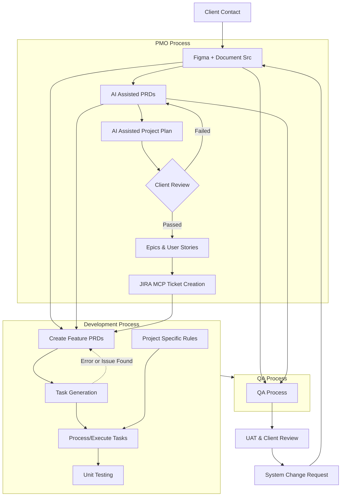

# AI Assisted Process

# End to End Flow



# Development Process

## **🚀 Developer Onboarding Guide - Cursor & Development Workflow**

This comprehensive guide documents all processes and prerequisites for new developers joining the project. It covers the complete development workflow from initial setup to feature implementation using Cursor AI and our established processes.

---

## **📋 Table of Contents**

1. Initial Setup & Prerequisites
2. Cursor Rules & Configuration
3. VS Code + GitHub Copilot Setup & Configuration
4. Process Files & Workflow
5. PRD Generation Process
6. UV Project Setup & Python Development
7. Productivity Enhancement Guidelines
8. AI-Assisted Development Workflow
9. Best Practices & Guidelines
10. Troubleshooting & Common Issues
11. Project Examples

---

## **🛠️ Initial Setup & Prerequisites**

### **Required Tools & Software**

- **Cursor Editor**: Latest version with AI capabilities (Primary)
- **VS Code**: Alternative editor with GitHub Copilot (Secondary)
- **Node.js**: Version 18+ for Next.js development
- **Python**: Version 3.11+ for Python projects
- **UV**: Python package manager and project manager
- **Git**: For version control
- **Package Manager**: npm, yarn, or pnpm (for Node.js projects)
- **Browser**: Chrome/Firefox with developer tools

### **Project Structure Understanding**

#### **Node.js/Next.js Projects**

```
project-root/
├── .cursor/
│   ├── rules/                    # Cursor rules for AI assistance
│   │   ├── DESIGN_SYSTEM.mdc     # Design system guidelines
│   │   ├── frontend-dev-rules.mdc # Frontend development rules
│   │   └── [other-rule-files]
│   └── process/                  # Process workflow files
│       ├── create-prd.md         # PRD creation process
│       ├── generate-tasks.md     # Task generation process
│       └── process-task-list.md  # Task implementation process
├── tasks/                        # Generated PRDs and task lists
│   ├── prd-[feature-name].md     # Generated PRD documents
│   └── [feature-name]/           # Feature-specific task folders
│       └── tasks-[prd-file-name].md # Generated task lists
├── docs/                         # Documentation
│   ├── components/               # Component documentation
│   ├── api/                      # API documentation
│   └── processes/                # Process documentation
└── src/                          # Application source code
```

#### **Python/UV Projects**

```
project-root/
├── .cursor/
│   ├── rules/                    # Cursor rules for AI assistance
│   │   ├── python-dev-rules.mdc  # Python development rules
│   │   ├── openai-agent-rules.mdc # OpenAI Agent SDK rules
│   │   └── [other-rule-files]
│   └── process/                  # Process workflow files
│       ├── create-prd.md         # PRD creation process
│       ├── generate-tasks.md     # Task generation process
│       └── process-task-list.md  # Task implementation process
├── tasks/                        # Generated PRDs and task lists
│   ├── prd-[feature-name].md     # Generated PRD documents
│   └── [feature-name]/           # Feature-specific task folders
│       └── tasks-[prd-file-name].md # Generated task lists
├── docs/                         # Documentation
│   ├── agents/                   # Agent documentation
│   ├── api/                      # API documentation
│   └── processes/                # Process documentation
├── src/                          # Application source code
│   ├── agents/                   # Agent implementations
│   ├── tools/                    # Custom tools
│   ├── utils/                    # Utility functions
│   └── main.py                   # Main application entry
├── tests/                        # Test files
├── pyproject.toml                # UV project configuration
├── uv.lock                       # UV lock file
└── README.md                     # Project documentation
```

---

## **⚙️ Cursor Rules & Configuration**

### **Setting Up Cursor Rules**

Cursor rules are essential for AI-assisted development. They provide context and guidelines for the AI to understand your project structure and requirements.

### **1. Create `.cursor/rules/` Directory**

```bash
mkdir -p .cursor/rules

```

### **2. Essential Rule Files**

**Design System Rules** (`.cursor/rules/DESIGN_SYSTEM.mdc`)

- Defines color palette, typography, spacing, and component guidelines
- Ensures visual consistency across the application
- Includes compliance checklists and automated validation

**Frontend Development Rules** (`.cursor/rules/frontend-dev-rules.mdc`)

- ShadCn-first approach for UI components
- Next.js and React best practices
- Form handling with React Hook Form + Zod
- Responsive design guidelines

**Project-Specific Rules**

- Technology stack specifications
- Code organization patterns
- Testing requirements
- Performance guidelines

**Python Development Rules** (`.cursor/rules/python-dev-rules.mdc`)

- UV project management and dependency handling
- Python 3.11+ features and best practices
- Type hints and type checking with mypy
- Code formatting with black and isort
- Testing with pytest and coverage
- Async/await patterns and best practices

**OpenAI Agent SDK Rules** (`.cursor/rules/openai-agent-rules.mdc`)

- Agent architecture and design patterns
- Tool integration and custom tool development
- Message handling and conversation flow
- Error handling and retry logic
- Performance optimization for agent responses
- Security best practices for API keys and data handling

### **VS Code Rules Adaptation**

For VS Code + GitHub Copilot users, adapt the Cursor rules:

1. **Create `.vscode/rules/` Directory**

   ```bash
   mkdir -p .vscode/rules
   cp .cursor/rules/* .vscode/rules/
   ```

2. **Modify Rule Files for VS Code**

   - Replace Cursor-specific references with VS Code equivalents
   - Update AI prompt instructions for GitHub Copilot Chat
   - Adapt file path references to VS Code workspace structure

3. **VS Code Rule File Structure**

   ```markdown
   # Rule Title for VS Code + GitHub Copilot

   ## Purpose

   Brief description of what this rule covers for VS Code development

   ## Guidelines

   - Specific guidelines and requirements for VS Code
   - Code examples and patterns
   - GitHub Copilot integration best practices

   ## VS Code Integration

   - How to use this rule with GitHub Copilot Chat
   - VS Code-specific configurations
   - Extension recommendations

   ## Compliance

   - How to verify compliance in VS Code
   - Automated checks with VS Code extensions
   - Manual validation steps
   ```

### **3. Rule File Structure**

```markdown
---
alwaysApply: true
---

# Rule Title

## Purpose

Brief description of what this rule covers

## Guidelines

- Specific guidelines and requirements
- Code examples and patterns
- Best practices

## Compliance

- How to verify compliance
- Automated checks
- Manual validation steps
```

---

## **🔧 VS Code + GitHub Copilot Setup & Configuration**

### **VS Code Installation & Setup**

1. **Install VS Code**

   ```bash
   # macOS
   brew install --cask visual-studio-code

   # Or download from: https://code.visualstudio.com/
   ```

2. **Install GitHub Copilot Extension**

   - Open VS Code
   - Go to Extensions (Ctrl/Cmd + Shift + X)
   - Search for "GitHub Copilot"
   - Install the official GitHub Copilot extension
   - Sign in with your GitHub account

3. **Essential VS Code Extensions**
   ```bash
   # Install via command line
   code --install-extension GitHub.copilot
   code --install-extension GitHub.copilot-chat
   code --install-extension ms-python.python
   code --install-extension ms-python.black-formatter
   code --install-extension ms-python.isort
   code --install-extension ms-python.mypy-type-checker
   code --install-extension bradlc.vscode-tailwindcss
   code --install-extension esbenp.prettier-vscode
   code --install-extension ms-vscode.vscode-eslint
   ```

### **VS Code Workspace Configuration**

1. **Create `.vscode/settings.json`**

   ```json
   {
     "editor.formatOnSave": true,
     "editor.codeActionsOnSave": {
       "source.organizeImports": true,
       "source.fixAll.eslint": true
     },
     "python.defaultInterpreterPath": "./.venv/bin/python",
     "python.formatting.provider": "black",
     "python.linting.enabled": true,
     "python.linting.mypyEnabled": true,
     "typescript.preferences.importModuleSpecifier": "relative",
     "tailwindCSS.includeLanguages": {
       "typescript": "typescript",
       "typescriptreact": "typescriptreact"
     },
     "github.copilot.enable": {
       "*": true,
       "yaml": false,
       "plaintext": false,
       "markdown": true
     }
   }
   ```

2. **Create `.vscode/extensions.json`**
   ```json
   {
     "recommendations": [
       "GitHub.copilot",
       "GitHub.copilot-chat",
       "ms-python.python",
       "ms-python.black-formatter",
       "ms-python.isort",
       "ms-python.mypy-type-checker",
       "bradlc.vscode-tailwindcss",
       "esbenp.prettier-vscode",
       "ms-vscode.vscode-eslint"
     ]
   }
   ```

### **GitHub Copilot Configuration**

1. **Copilot Settings**

   ```json
   {
     "github.copilot.enable": {
       "*": true,
       "yaml": false,
       "plaintext": false,
       "markdown": true
     },
     "github.copilot.editor.enableAutoCompletions": true,
     "github.copilot.editor.enableCodeActions": true,
     "github.copilot.chat.enableCodeActions": true
   }
   ```

2. **Copilot Chat Integration**
   - Use `Ctrl/Cmd + I` to open Copilot Chat
   - Use `Ctrl/Cmd + Shift + I` for inline chat
   - Use `Ctrl/Cmd + Enter` to accept suggestions

### **VS Code Process Files Adaptation**

Since VS Code doesn't have the same `.cursor/process/` structure, adapt the process files:

1. **Create `.vscode/process/` Directory**

   ```bash
   mkdir -p .vscode/process
   cp .cursor/process/* .vscode/process/
   ```

2. **Modify Process Files for VS Code**
   - Replace `@create-prd.md` references with file paths
   - Update instructions to use VS Code's file explorer
   - Adapt AI prompts for GitHub Copilot Chat

### **GitHub Copilot Prompt Templates**

1. **Feature Implementation Prompt**

   ```
   Using GitHub Copilot Chat, help me implement [feature description].
   Context: [relevant background information]
   Requirements: [specific requirements from PMO/Jira]
   Design Reference: [Figma link or description]

   Please follow our process files:
   - .vscode/process/create-prd.md for PRD creation
   - .vscode/process/generate-tasks.md for task generation
   - .vscode/process/process-task-list.md for implementation
   ```

2. **Code Review Prompt**

   ```
   Please review this code for:
   - Code quality and best practices
   - Potential bugs or edge cases
   - Performance optimizations
   - Security considerations
   - Test coverage recommendations

   Use our project's coding standards and follow the patterns in our codebase.
   ```

3. **Python Agent Development Prompt**

   ```
   Help me create a Python agent with OpenAI SDK that:
   - [specific agent functionality]
   - Uses UV for project management
   - Implements proper error handling
   - Includes comprehensive testing
   - Follows async/await patterns

   Follow our Python development rules in .vscode/rules/python-dev-rules.mdc
   ```

### **VS Code Workflow Optimization**

1. **Keyboard Shortcuts**

   ```
   Ctrl/Cmd + I          - Open Copilot Chat
   Ctrl/Cmd + Shift + I  - Inline Copilot Chat
   Ctrl/Cmd + Enter      - Accept Copilot suggestion
   Tab                   - Accept next word of suggestion
   Esc                   - Dismiss suggestion
   Alt + ]               - Next suggestion
   Alt + [               - Previous suggestion
   ```

2. **File Navigation**

   ```
   Ctrl/Cmd + P          - Quick file open
   Ctrl/Cmd + Shift + P  - Command palette
   Ctrl/Cmd + B          - Toggle sidebar
   Ctrl/Cmd + `          - Toggle terminal
   ```

3. **Git Integration**
   ```
   Ctrl/Cmd + Shift + G  - Source control panel
   Ctrl/Cmd + K, Ctrl/Cmd + O - Open repository
   ```

### **VS Code + UV Python Development**

1. **Python Environment Setup**

   ```bash
   # In VS Code terminal
   uv init --package .
   uv add openai pydantic httpx python-dotenv
   uv add --dev pytest pytest-asyncio black isort mypy ruff
   ```

2. **VS Code Python Configuration**

   ```json
   {
     "python.defaultInterpreterPath": "./.venv/bin/python",
     "python.terminal.activateEnvironment": true,
     "python.formatting.provider": "black",
     "python.linting.enabled": true,
     "python.linting.mypyEnabled": true,
     "python.testing.pytestEnabled": true,
     "python.testing.pytestArgs": ["tests"]
   }
   ```

3. **Run Commands in VS Code**
   ```bash
   # Use Ctrl/Cmd + Shift + ` to open terminal
   uv run python src/main.py
   uv run pytest
   uv run black src tests
   uv run mypy src
   ```

### **VS Code Productivity Tips**

1. **Multi-Cursor Editing**

   - `Ctrl/Cmd + D` - Select next occurrence
   - `Ctrl/Cmd + Shift + L` - Select all occurrences
   - `Alt + Click` - Add cursor at click position

2. **Code Navigation**

   - `F12` - Go to definition
   - `Alt + F12` - Peek definition
   - `Shift + F12` - Find all references
   - `Ctrl/Cmd + T` - Go to symbol in workspace

3. **IntelliSense & Copilot**
   - Use descriptive variable names for better suggestions
   - Add comments to guide Copilot
   - Use consistent code patterns
   - Leverage Copilot Chat for complex logic

### **VS Code Troubleshooting**

1. **Common Issues**

   - **Copilot not working**: Check GitHub authentication
   - **Python not found**: Verify interpreter path in settings
   - **Extensions not loading**: Restart VS Code
   - **Terminal issues**: Check shell configuration

2. **Performance Optimization**
   - Disable unused extensions
   - Use workspace-specific settings
   - Clear VS Code cache if needed
   - Update to latest version

---

## **🔄 Process Files & Workflow**

### **Understanding Process Files**

Process files are Cursor rules that guide AI-assisted development tasks and ensure consistency in our workflow. These files are located in `.cursor/process/` and define specific workflows for different development phases.

- [create-prd.md](process/create-prd.md) - PRD creation process
- [generate-tasks.md](process/generate-tasks.md) - Task generation from PRD
- [process-task-list.md](process/process-task-list.md) - Task implementation management

### **🔄 PRD Generation Process**

**1. `create-prd.md` - PRD Creation Process**

**Purpose**: Guides AI assistant in creating detailed Product Requirements Documents (PRD) in Markdown format

**Process**:

1. **Receive Initial Prompt**: User provides brief description of new feature using the PMO PRD, Jira ticket description, Figma Reference Link to the feature.
2. **Ask Clarifying Questions**: AI asks specific questions to gather sufficient detail
3. **Generate PRD**: Based on prompt and answers, generate structured PRD
4. **Save PRD**: Save as `prd-[feature-name].md` in `/tasks/` directory

**Usage**:

- Reference this file in Cursor chat: `@create-prd.md`
- Provide feature description ( Include PMO PRD, Jira Ticket, Figma Design Reference MCP link would be better than a screenshot)
- Answer clarifying questions
- AI generates comprehensive PRD

**Output**: Creates PRD file in `/tasks/prd-[feature-name].md` with:

- Introduction/Overview
- Goals and user stories
- Functional requirements
- Non-goals (out of scope)
- Design considerations
- Technical considerations
- Success metrics
- Open questions

### **2. `generate-tasks.md` - Task Generation from PRD**

**Purpose**: Creates detailed, step-by-step task list from existing PRD

**Process**:

1. **Receive PRD Reference**: User points to specific PRD file
2. **Analyze PRD**: AI reads and analyzes functional requirements
3. **Assess Current State**: Review existing codebase and patterns
4. **Phase 1**: Generate high-level parent tasks
5. **Wait for Confirmation**: User confirms with "Go"
6. **Phase 2**: Generate detailed sub-tasks
7. **Identify Relevant Files**: List files to create/modify
8. **Save Task List**: Save as `tasks-[prd-file-name].md`

**Usage**:

- Reference this file in Cursor chat: `@generate-tasks.md`
- Point to existing PRD file: `/tasks/prd-[feature-name].md`
- Review high-level tasks
- Confirm with "Go" to generate sub-tasks

**Output**: Creates task file in `/tasks/[feature-name]/tasks-[prd-file-name].md` with:

- Relevant files section
- Parent tasks and sub-tasks
- Implementation notes
- Testing requirements

### **3. `process-task-list.md` - Task Implementation Management**

**Purpose**: Manages task list implementation and progress tracking

**Key Rules**:

- **One sub-task at a time**: Don't start next sub-task without user permission
- **Completion protocol**: Mark sub-tasks `[x]` when completed
- **Parent task completion**: Mark parent task `[x]` when all sub-tasks complete
- **Testing**: Run full test suite before committing
- **Commit format**: Use conventional commit format with descriptive messages

**Usage**:

- Reference this file in Cursor chat: `@process-task-list.md` and ask it to start processing and implementing those
- It will work through tasks systematically
- It will update task list after each completion
- It will ask for permission before starting a new task

**Process**:

1. **Task Analysis**: Parse task requirements
2. **Implementation**: Complete one sub-task at a time
3. **Testing**: Run tests after each parent task completion
4. **Commit**: Use proper commit format
5. **Update**: Maintain task list accuracy

---

## **🐍 UV Project Setup & Python Development**

### **UV Installation & Setup**

1. **Install UV**

   ```bash
   # macOS/Linux
   curl -LsSf https://astral.sh/uv/install.sh | sh

   # Windows
   powershell -c "irm https://astral.sh/uv/install.ps1 | iex"

   # Or via pip
   pip install uv
   ```

2. **Verify Installation**
   ```bash
   uv --version
   ```

### **Creating a New UV Project**

1. **Initialize Project**

   ```bash
   # Create new package project
   uv init --package my-agent-project
   cd my-agent-project

   # Or initialize in existing directory
   uv init --package .
   ```

2. **Project Structure Setup**

   ```bash
   # Create directory structure
   mkdir -p src/agents src/tools src/utils tests docs/agents

   # Create main entry point
   touch src/main.py
   touch src/agents/__init__.py
   touch src/tools/__init__.py
   touch src/utils/__init__.py
   ```

3. **Configure pyproject.toml**

   ```toml
   [project]
   name = "my-agent-project"
   version = "0.1.0"
   description = "AI Agent project with OpenAI SDK"
   requires-python = ">=3.11"
   dependencies = [
       "openai>=1.0.0",
       "pydantic>=2.0.0",
       "httpx>=0.25.0",
       "python-dotenv>=1.0.0",
   ]

   [project.optional-dependencies]
   dev = [
       "pytest>=7.0.0",
       "pytest-asyncio>=0.21.0",
       "pytest-cov>=4.0.0",
       "black>=23.0.0",
       "isort>=5.12.0",
       "mypy>=1.0.0",
       "ruff>=0.1.0",
   ]

   [build-system]
   requires = ["hatchling"]
   build-backend = "hatchling.build"

   [tool.black]
   line-length = 88
   target-version = ['py311']

   [tool.isort]
   profile = "black"
   line_length = 88

   [tool.mypy]
   python_version = "3.11"
   strict = true

   [tool.pytest.ini_options]
   asyncio_mode = "auto"
   testpaths = ["tests"]
   ```

### **OpenAI Agent SDK Setup**

1. **Install OpenAI SDK**

   ```bash
   uv add openai
   ```

2. **Environment Configuration**

   ```bash
   # Create .env file
   echo "OPENAI_API_KEY=your_api_key_here" > .env
   echo "OPENAI_BASE_URL=https://api.openai.com/v1" >> .env
   ```

3. **Basic Agent Structure**

   ```python
   # src/agents/base_agent.py
   from typing import Any, Dict, List, Optional
   from openai import OpenAI
   from pydantic import BaseModel
   import os
   from dotenv import load_dotenv

   load_dotenv()

   class AgentMessage(BaseModel):
       role: str
       content: str

   class BaseAgent:
       def __init__(self, model: str = "gpt-4"):
           self.client = OpenAI(
               api_key=os.getenv("OPENAI_API_KEY"),
               base_url=os.getenv("OPENAI_BASE_URL")
           )
           self.model = model
           self.messages: List[Dict[str, str]] = []

       async def add_message(self, role: str, content: str) -> None:
           self.messages.append({"role": role, "content": content})

       async def get_response(self) -> str:
           response = self.client.chat.completions.create(
               model=self.model,
               messages=self.messages
           )
           return response.choices[0].message.content
   ```

### **Development Workflow with UV**

1. **Dependency Management**

   ```bash
   # Add new dependency
   uv add requests

   # Add development dependency
   uv add --dev pytest

   # Sync dependencies
   uv sync

   # Run with UV
   uv run python src/main.py
   ```

2. **Testing Setup**

   ```bash
   # Install test dependencies
   uv add --dev pytest pytest-asyncio pytest-cov

   # Run tests
   uv run pytest

   # Run with coverage
   uv run pytest --cov=src
   ```

3. **Code Quality Tools**

   ```bash
   # Install code quality tools
   uv add --dev black isort mypy ruff

   # Format code
   uv run black src tests
   uv run isort src tests

   # Type checking
   uv run mypy src

   # Linting
   uv run ruff check src tests
   ```

### **Agent Development Best Practices**

1. **Agent Architecture**

   - Use composition over inheritance
   - Implement clear interfaces for tools
   - Separate concerns (logic, data, presentation)
   - Use async/await for I/O operations

2. **Error Handling**

   ```python
   import logging
   from typing import Optional

   logger = logging.getLogger(__name__)

   class AgentError(Exception):
       pass

   async def safe_agent_call(func, *args, **kwargs):
       try:
           return await func(*args, **kwargs)
       except Exception as e:
           logger.error(f"Agent error: {e}")
           raise AgentError(f"Agent operation failed: {e}")
   ```

3. **Tool Integration**

   ```python
   # src/tools/base_tool.py
   from abc import ABC, abstractmethod
   from typing import Any, Dict
   from pydantic import BaseModel

   class ToolResult(BaseModel):
       success: bool
       data: Any
       error: Optional[str] = None

   class BaseTool(ABC):
       @abstractmethod
       async def execute(self, **kwargs) -> ToolResult:
           pass

       @property
       @abstractmethod
       def name(self) -> str:
           pass

       @property
       @abstractmethod
       def description(self) -> str:
           pass
   ```

4. **Configuration Management**

   ```python
   # src/config.py
   from pydantic import BaseSettings
   from typing import Optional

   class Settings(BaseSettings):
       openai_api_key: str
       openai_base_url: str = "https://api.openai.com/v1"
       model: str = "gpt-4"
       max_tokens: int = 1000
       temperature: float = 0.7

       class Config:
           env_file = ".env"

   settings = Settings()
   ```

### **Testing Strategies**

1. **Unit Tests**

   ```python
   # tests/test_agent.py
   import pytest
   from src.agents.base_agent import BaseAgent

   @pytest.mark.asyncio
   async def test_agent_initialization():
       agent = BaseAgent()
       assert agent.model == "gpt-4"
       assert len(agent.messages) == 0

   @pytest.mark.asyncio
   async def test_add_message():
       agent = BaseAgent()
       await agent.add_message("user", "Hello")
       assert len(agent.messages) == 1
       assert agent.messages[0]["role"] == "user"
   ```

2. **Integration Tests**

   ```python
   # tests/test_integration.py
   import pytest
   from src.main import app

   @pytest.mark.asyncio
   async def test_agent_workflow():
       # Test complete agent workflow
       pass
   ```

### **Deployment Considerations**

1. **Environment Variables**

   ```bash
   # Production environment
   export OPENAI_API_KEY="prod_key"
   export OPENAI_BASE_URL="https://api.openai.com/v1"
   export LOG_LEVEL="INFO"
   ```

2. **Docker Setup**

   ```dockerfile
   FROM python:3.11-slim

   WORKDIR /app

   COPY pyproject.toml uv.lock ./
   RUN pip install uv
   RUN uv sync --frozen

   COPY src/ ./src/
   COPY tests/ ./tests/

   CMD ["uv", "run", "python", "src/main.py"]
   ```

---

## **⚡ Productivity Enhancement Guidelines**

### **Cursor AI Optimization**

1. **Effective Prompting Strategies**

   - Use specific, actionable prompts with clear context
   - Include relevant file references using `@filename`
   - Provide examples of desired output format
   - Break complex tasks into smaller, focused requests
   - Use process files as context: `@create-prd.md`, `@generate-tasks.md`, `@process-task-list.md`

2. **Context Management**

   - Keep relevant files open in Cursor for better AI context
   - Use the chat history to maintain conversation context
   - Reference previous decisions and patterns in new requests
   - Maintain consistent naming conventions across the project

3. **Code Generation Efficiency**
   - Request code with inline comments for better understanding
   - Ask for multiple implementation approaches when appropriate
   - Request test cases alongside implementation
   - Use AI to generate boilerplate and then customize

### **Development Workflow Optimization**

1. **Pre-Development Setup**

   - Review existing codebase patterns before starting
   - Set up proper development environment with all tools
   - Configure linting and formatting rules
   - Establish testing framework and coverage requirements

2. **Feature Development Process**

   - Always start with PRD creation using `@create-prd.md`
   - Generate tasks using `@generate-tasks.md` before coding
   - Follow the task implementation process with `@process-task-list.md`
   - Implement one sub-task at a time with proper testing

3. **Code Quality Assurance**
   - Run tests after each completed sub-task
   - Use AI to generate comprehensive test cases
   - Request code reviews for complex implementations
   - Maintain consistent commit message format

### **Time Management & Focus**

1. **Pomodoro Technique Integration**

   - Work in 25-minute focused sessions
   - Use 5-minute breaks to review AI suggestions
   - Take longer breaks after completing major tasks
   - Track productivity metrics and adjust workflow

2. **Task Prioritization**

   - Focus on high-impact, low-effort tasks first
   - Break down complex features into manageable chunks
   - Use AI to estimate task complexity and time requirements
   - Maintain a clear backlog of pending tasks

3. **Learning & Skill Development**
   - Use AI to explain complex concepts and patterns
   - Request code examples for new technologies
   - Practice with AI-generated coding challenges
   - Document new learnings and best practices

### **Collaboration & Communication**

1. **Team Coordination**

   - Share AI-generated insights and solutions with team
   - Use consistent documentation standards
   - Maintain clear communication about task progress
   - Leverage AI for code review and feedback

2. **Knowledge Sharing**
   - Document successful AI prompts and workflows
   - Create templates for common development patterns
   - Share productivity tips and techniques
   - Maintain a team knowledge base

---

## **🤖 AI-Assisted Development Workflow**

### **Daily Development Routine**

1. **Morning Setup (5 minutes)**

   - Review pending tasks and priorities
   - Check for any new PRDs or requirements
   - Set up development environment
   - Review yesterday's progress and notes

2. **Feature Development Cycle**

   ```
   PRD Creation → Task Generation → Implementation → Testing → Documentation
   ```

3. **End-of-Day Review (10 minutes)**
   - Update task progress and status
   - Commit completed work with proper messages
   - Plan next day's priorities
   - Document any blockers or issues

### **AI Prompt Templates**

1. **Feature Implementation Prompt**

   ```
   @create-prd.md
   I need to implement [feature description].
   Context: [relevant background information]
   Requirements: [specific requirements from PMO/Jira]
   Design Reference: [Figma link or description]
   ```

2. **Code Review Prompt**

   ```
   Please review this code for:
   - Code quality and best practices
   - Potential bugs or edge cases
   - Performance optimizations
   - Security considerations
   - Test coverage recommendations
   ```

3. **Debugging Prompt**

   ```
   I'm experiencing [specific issue].
   Error message: [paste error]
   Relevant code: [paste code snippet]
   Expected behavior: [describe expected outcome]
   Actual behavior: [describe what's happening]
   ```

4. **Python Agent Development Prompt**

   ```
   @create-prd.md
   I need to create a Python agent with OpenAI SDK that:
   - [specific agent functionality]
   - Uses UV for project management
   - Implements proper error handling
   - Includes comprehensive testing
   - Follows async/await patterns
   ```

5. **UV Project Setup Prompt**

   ```
   Help me set up a new UV project for [project description]:
   - Configure pyproject.toml with appropriate dependencies
   - Set up project structure for [Python/Agent/API] development
   - Include development tools (testing, linting, formatting)
   - Create basic configuration files
   ```

6. **VS Code + GitHub Copilot Feature Implementation Prompt**
   ```
   Using GitHub Copilot Chat in VS Code, help me implement [feature description]:
   - Follow our .vscode/process/create-prd.md for PRD creation
   - Use .vscode/process/generate-tasks.md for task breakdown
   - Implement using .vscode/process/process-task-list.md workflow
   - Ensure VS Code extensions are properly configured
   - Use UV for Python dependency management
   ```

### **Productivity Metrics Tracking**

| **Metric**           | **Target**         | **Measurement**                     |
| -------------------- | ------------------ | ----------------------------------- |
| PRD Creation Time    | < 30 minutes       | Time from request to completed PRD  |
| Task Generation Time | < 15 minutes       | Time from PRD to task list          |
| Implementation Speed | 2-3 sub-tasks/hour | Sub-tasks completed per hour        |
| Code Quality Score   | > 90%              | Automated code quality metrics      |
| Test Coverage        | > 95%              | Percentage of code covered by tests |

---

## **🎯 Best Practices & Guidelines**

### **Development Best Practices**

1. **Component-First Approach**
   - Always check existing components first
   - Reuse and extend when possible
   - Create new components only when necessary
2. **Design System Compliance**
   - Follow color palette guidelines
   - Use defined typography scale
   - Maintain consistent spacing
   - Implement proper accessibility
3. **Code Quality**
   - Write clean, readable code
   - Include comprehensive comments
   - Follow naming conventions
   - Implement proper error handling
4. **Testing Strategy**
   - Write tests before implementation (TDD)
   - Maintain high test coverage
   - Include integration and E2E tests
   - Test edge cases and error scenarios

### **AI-Assisted Development Best Practices**

1. **Clear Prompts**
   - Be specific about requirements
   - Include context and constraints
   - Specify desired output format
   - Provide examples when helpful
2. **Iterative Refinement**
   - Start with basic implementation
   - Refine based on feedback
   - Test thoroughly at each step
   - Document changes and decisions
3. **Code Review**
   - Review AI-generated code carefully
   - Verify logic and edge cases
   - Check for security vulnerabilities
   - Ensure performance optimization

### **Collaboration Guidelines**

1. **Communication**
   - Update task status regularly
   - Document decisions and rationale
   - Share knowledge and learnings
   - Provide constructive feedback
2. **Version Control**
   - Use descriptive commit messages
   - Create feature branches
   - Review code before merging
   - Keep commits atomic and focused
3. **Documentation**
   - Document all processes and decisions
   - Keep documentation up to date
   - Share knowledge with team
   - Create reusable templates

## **📚 Additional Resources**

### **Documentation**

- [Cursor Documentation](https://cursor.sh/docs)
- [Next.js Documentation](https://nextjs.org/docs)
- [React Documentation](https://react.dev/)
- [Tailwind CSS Documentation](https://tailwindcss.com/docs)
- [ShadCn UI Documentation](https://ui.shadcn.com/)

### **Tools & Services**

- [Storybook](https://storybook.js.org/) - Component development
- [Jest](https://jestjs.io/) - Testing framework
- [Playwright](https://playwright.dev/) - E2E testing
- [ESLint](https://eslint.org/) - Code linting
- [Prettier](https://prettier.io/) - Code formatting

---

## **🔧 Troubleshooting & Common Issues**

### **Common AI-Assisted Development Issues**

1. **AI Context Loss**

   - **Problem**: AI forgets previous context or decisions
   - **Solution**: Use `@filename` references, maintain chat history, provide clear context in each request
   - **Prevention**: Keep relevant files open, use consistent naming, document key decisions

2. **Inconsistent Code Generation**

   - **Problem**: AI generates code that doesn't follow project patterns
   - **Solution**: Reference existing code examples, use process files, provide specific style guidelines
   - **Prevention**: Maintain comprehensive cursor rules, review generated code before implementation

3. **Task Implementation Drift**

   - **Problem**: Implementation deviates from original PRD or task list
   - **Solution**: Regularly reference original requirements, update task list as needed, get approval for scope changes
   - **Prevention**: Use structured task management, maintain clear requirements documentation

4. **Testing Gaps**

   - **Problem**: Insufficient test coverage or missing edge cases
   - **Solution**: Request comprehensive test cases, use AI to identify edge cases, implement TDD approach
   - **Prevention**: Include testing requirements in PRDs, use AI to generate test scenarios

5. **VS Code + GitHub Copilot Issues**

   - **Problem**: Copilot suggestions not appearing or inaccurate
   - **Solution**: Check GitHub authentication, verify extension installation, restart VS Code
   - **Prevention**: Keep extensions updated, maintain proper workspace configuration

6. **VS Code Performance Issues**
   - **Problem**: Slow response times or high memory usage
   - **Solution**: Disable unused extensions, clear VS Code cache, update to latest version
   - **Prevention**: Use workspace-specific settings, limit open files, optimize extension configuration

### **Performance Optimization**

1. **Cursor Performance**

   - Clear chat history periodically for large projects
   - Use focused file references instead of entire codebase
   - Optimize cursor rules for faster processing
   - Use specific prompts instead of broad requests

2. **Development Speed**

   - Batch similar tasks together
   - Use AI templates for common patterns
   - Automate repetitive tasks with AI assistance
   - Maintain a library of successful prompts

3. **Code Quality Maintenance**
   - Regular code reviews with AI assistance
   - Automated quality checks and formatting
   - Consistent documentation standards
   - Regular refactoring with AI guidance

### **Getting Help & Support**

1. **Internal Resources**

   - Team knowledge base and documentation
   - Senior developer mentorship
   - Code review processes
   - Regular team retrospectives

2. **External Resources**

   - Cursor documentation and community
   - Technology-specific documentation
   - AI prompt engineering resources
   - Development best practices guides

3. **Escalation Process**
   - Document issues with clear problem description
   - Include relevant code and error messages
   - Provide context and attempted solutions
   - Use structured communication templates

---

## **📚 Project Examples**

### **Successful Implementations**

- **GoLotusAI**: Complete AI-assisted development workflow implementation
- **Sikila**: Mobile app development with AI-driven task management
- **E-commerce Platform**: Feature-rich application with comprehensive testing
- **Dashboard Application**: Real-time data visualization with AI-generated components

### **Lessons Learned**

1. **Process Adherence**: Following the structured workflow significantly improves outcomes
2. **AI Context Management**: Proper context setting is crucial for quality results
3. **Iterative Development**: Small, focused tasks lead to better code quality
4. **Testing Integration**: Early testing integration prevents technical debt
5. **Documentation**: Comprehensive documentation accelerates team onboarding

## **Success Metrics**

| **Category**                  | **Metric**                                   | **Target** |
| ----------------------------- | -------------------------------------------- | ---------- |
| 🚀 **Development Efficiency** | Faster development with Cursor AI workflow   | 60%        |
|                               | Reduction in code review iterations          | 60%        |
|                               | Consistency in design system implementation  | 80%        |
| 🛠 **Code Quality**            | TypeScript coverage                          | 100%       |
|                               | Component documentation coverage             | 90%        |
|                               | Hardcoded design values                      | 🚫 Zero    |
|                               | Accessibility compliance                     | ✅ 100%    |
| 📈 **Process Effectiveness**  | Systematic PRD generation with AI assistance | —          |
|                               | Automated task breakdown and management      | —          |
|                               | Consistent implementation patterns           | —          |
|                               | Comprehensive documentation standards        | —          |

---

## **🤝 Support & Contact**

### **Getting Help**

1. **Team Chat**: Use team communication channels
2. **Code Reviews**: Request reviews from senior developers
3. **Documentation**: Check this guide and project docs
4. **External Resources**: Use provided learning resources

### **Contributing to This Guide**

- Update processes as they evolve
- Add new best practices
- Document common issues and solutions
- Share learnings with the team

---

**Last Updated**: August 13, 2025  **Version**: 1.0 **Maintained By**: Development Team

---

_This guide is a living document. Please contribute to keeping it up to date and relevant for the team._

# Quality Assurance Process

### **QA Onboarding — AI-Driven Web E2E with Cursor + Playwright (JavaScript)**

**Audience:** Manual QA, SDET, interns

**Goal:** From zero → running AI-generated Playwright tests in one sitting

**Tools:** Cursor (editor + AI + terminal), Playwright (JS), GitHub, GitHub Actions, Notion, 1Password (optional)

---

### **Purpose**

This onboarding guide takes you through the **full QA automation workflow** using **Cursor AI** for writing and converting test cases, **Playwright** for execution, and **GitHub Actions** for CI/CD — all while following our standard QA process.

By the end of this onboarding, you will:

- Understand our QA workflow from requirements → execution.
- Set up your local environment in **Cursor**.
- Create and Convert test cases into Scripts.
- Run tests locally and in CI.
- Access test reports and traces.
- Follow security best practices for test data and credentials.

---

📌 **Navigation:**

- Quick Outcomes & Prerequisites
- QA Workflow Overview
- Local Environment Setup in Cursor
- Writing & Converting Tests
- Running Tests & Viewing Reports
- CI/CD with GitHub Actions
- Seed Data & Test Credentials
- Project Folder Structure
- AI Prompt Library for Cursor
- Troubleshooting
- Checklists
